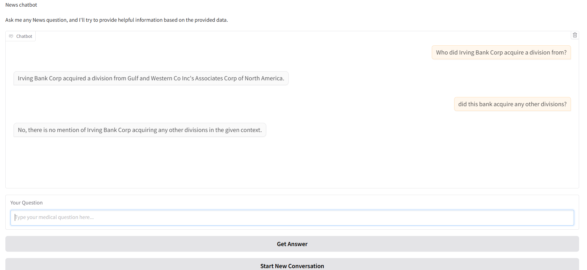

# Reuters-21578 News Classification and Analysis

This repository contains a set of Jupyter notebooks that respond to a semantic analysis exercise based on the Reuters-21578 dataset. The goal of the exercise is to explore, analyze, and classify financial articles into predefined topics while leveraging both traditional and modern techniques.

## Exercise Context

The **Reuters-21578 dataset** consists of 21,578 financial articles tagged with topics. The exercise focuses on five specific topics:
- **Money/Foreign Exchange (MONEY-FX)**
- **Shipping (SHIP)**
- **Interest Rates (INTEREST)**
- **Mergers/Acquisitions (ACQ)**
- **Earnings and Earnings Forecasts (EARN)**

### Analysis Goals

1. **Descriptive Analysis**: Identify the main characteristics of each topic in the dataset.
2. **Predictive Analysis**: Develop and compare approaches for automatic classification of articles into these categories.

---

## Repository Structure

1. **`Eda.ipynb`**  
   Conducts an exploratory data analysis (EDA) of the Reuters-21578 dataset.

2. **`nlp_classique.ipynb`**  
   Demonstrates classical natural language processing techniques.
   
3. **`Classification_using_embeddings.ipynb`**  
   Implements a classification approach using embeddings to represent text data. The notebook explores:
   - Text embedding generation.
   - Training classification models on embedded representations.
   - Evaluation of classification performance.

4. **`classification_using_llm_invocation.ipynb`**  
   This notebook explores text classification using large language models (LLMs) with the following approaches:
   - Zero-Shot Classification: Classifying articles without any prior labeled examples by leveraging LLMs' contextual understanding.
   - One-Shot Classification: Providing a single example to guide the model's understanding of the classification task.
    
4. **`multilabel_classification.ipynb`**  
   Tackles multi-label classification tasks inherent to the dataset. The notebook includes:
   - Handling articles tagged with multiple topics.
   - Model training and evaluation for multi-label classification.
   - Performance metrics tailored to multi-label problems.

6. **`news_RAG.ipynb`**  
   Implements a **Retrieval-Augmented Generation (RAG)** pipeline using the dataset:
   - Combines retrieval mechanisms with a generative model to provide enhanced answers.
   - Utilizes dataset content to generate relevant and informed responses.
## Example Interaction with the RAG

---

